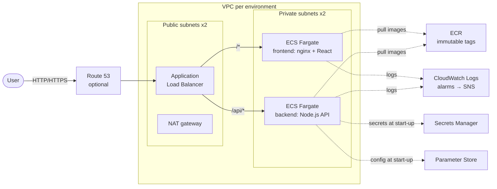
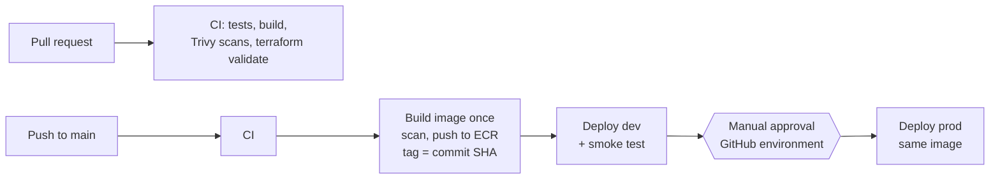

# ECS Fargate CI/CD: secure deployment pipeline for a Node.js + React app

A reference implementation of a production-style deployment pipeline on AWS:
a Node.js API and a React frontend, containerized with Docker, deployed to
**Amazon ECS Fargate** by **GitHub Actions**, with infrastructure in **Terraform**.

Everything runs from GitHub: code is edited in the browser, Terraform and Docker run in
GitHub Actions. Built to demonstrate: OIDC authentication (no AWS keys in GitHub), least-privilege
IAM, secrets that never touch the image or the repository, image scanning,
build-once/promote-everywhere releases, approval gates for production,
automatic and manual rollback, and monitoring with alerts.

## Architecture





## What is implemented

| Area | Implementation |
|---|---|
| **CI** | Tests and builds for both apps, Trivy scans (secrets, dependencies, images, IaC), `terraform fmt`/`validate` on every PR. PRs never get AWS credentials. |
| **Infrastructure as Code** | Terraform run from GitHub Actions (plan / apply / destroy per stack), remote state in a versioned, encrypted S3 bucket with native locking. |
| **Images** | Multi-stage Dockerfiles, non-root users, npm/yarn removed from the runtime image, read-only root filesystem for the API, nginx-unprivileged for the frontend. |
| **Releases** | Image built and scanned once, tagged with the commit SHA (immutable ECR tags), promoted from dev to prod unchanged. |
| **Environments** | Separate VPC, cluster, secrets and IAM role per environment. Prod requires approval in a protected GitHub environment. |
| **GitHub → AWS auth** | GitHub OIDC. The Terraform role trusts only the `infra` environment, the push role trusts only `main`, and each deploy role trusts only its own GitHub environment (`repo:<owner>/<repo>:environment:prod`). |
| **IAM** | Execution role reads only its own secret and parameter; deploy role can update only its own services and pass only its own task roles. |
| **Secrets** | Secrets Manager (sensitive) and Parameter Store (non-sensitive), injected by ECS at start-up. Never in Git, images, workflow files or logs. |
| **Networking** | Tasks in private subnets with no public IP; ALB is the only entry point; task security groups accept traffic only from the ALB and allow only HTTPS outbound. |
| **Reliability** | ALB and container health checks, rolling deployments at 100% minimum capacity, ECS deployment circuit breaker with automatic rollback, post-deploy smoke test, manual rollback workflow, CPU autoscaling. |
| **Observability** | CloudWatch Logs (structured JSON), Container Insights, alarms for 5xx, unhealthy targets and CPU, failed-deployment alerts via EventBridge → SNS, VPC flow logs. |
| **Maintenance** | Dependabot for npm, Docker base images, GitHub Actions and Terraform providers. |

## Repository layout

```
app/backend/            Node.js API (Express) + tests + Dockerfile
app/frontend/           React (Vite) app served by nginx + Dockerfile
bootstrap/bootstrap.yml One-time CloudFormation: GitHub OIDC provider, state bucket, Terraform role
infra/shared/           ECR repositories, image-push role
infra/env/              Per-environment stack (dev.tfvars, prod.tfvars)
.github/workflows/      ci.yml, deploy.yml, _deploy.yml (reusable), rollback.yml, infra.yml (Terraform)
.github/actions/        setup-trivy: pinned, checksum-verified scanner install
docs/RUNBOOK.md         Deploy, roll back, troubleshoot, manage secrets, maintain
LAB_GUIDE.md            Step-by-step build guide
```

## Quick start

See [LAB_GUIDE.md](LAB_GUIDE.md) for the full walkthrough, and
[docs/RUNBOOK.md](docs/RUNBOOK.md) for day-2 operations.

## Possible next steps

AWS WAF on the ALB, CloudFront in front of the frontend, blue/green deployments
with CodeDeploy, Terraform plan/apply in CI with a separate role, VPC endpoints
instead of the NAT gateway, and commit-SHA pinning of all third-party actions.
